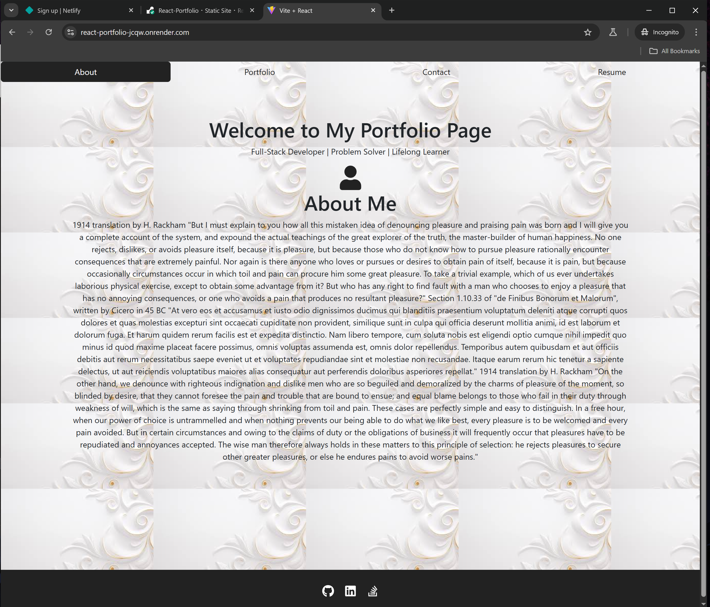

# React Portfolio


## Description

A one page React website that dynamically inserts changes to the page.

## Table of Contents

- [Installation](#installation)
- [Link](#link)
- [License](#license)
- [Contributing](#contributing)
- [Questions](#questions)
- [Screenshot](#screenshot)

## Installation

Run the following command to install dependencies:

```
npm i
```

## Link

To go to the Render website [Click here for Portfolio](https://react-portfolio-jcqw.onrender.com/)


## License

This project is licensed under the MIT license. For more information, see [this link](https://opensource.org/licenses/MIT).

## Contributing
This is just a portfolio website but please contact me for more information!


## Questions

If you have any questions, feel free to reach out to me at [wick9872000@gmail.com](mailto:wick9872000@gmail.com). You can also find me on GitHub at [Wick000](https://github.com/Wick000).


## Screenshot


